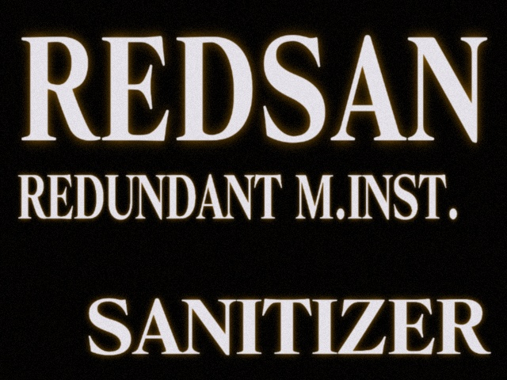

# RedSan



RedSan (internal codename **GPUPunk**) is a dynamic binary instrumentation tool for detecting and analyzing **redundant memory instructions** in GPU programs — redundant writes and other wasted memory traffic that silently hurts kernel performance. It instruments CUDA kernels using NVIDIA's compute-sanitizer patching API and reports redundancy down to the calling-context level.

## How it works

RedSan is composed of several cooperating components, most of which are pulled in as git submodules:

| Component | Role |
|---|---|
| `gpu-patch/` | CUDA fatbin patches (built with `nvcc --compile-as-tools-patch`) that instrument memory accesses and addresses inside kernels, based on NVIDIA's compute-sanitizer `MemoryTracker` sample. |
| `gputrigger/` (submodule) | The runtime driver, loaded via `LD_PRELOAD` as `libgputrigger.so`. It attaches the `gpu-patch` instrumentation to the target process and selects the active analysis mode. |
| `redshow/` (submodule) | The redundancy-analysis engine. It consumes the instrumented memory trace and computes redundant-write statistics, optionally attributed to calling context (CCT). |
| `libmonitor/` (submodule, from [HPCToolkit](https://github.com/HPCToolkit/libmonitor)) | Process/thread interposition library required by the runtime to intercept process lifecycle events. |
| `cubin_filter/` | An optional `LD_PRELOAD` shim that filters cubins before they are loaded, used to control which kernels get instrumented. |

Calling-context attribution is provided through [DrCCTProf](https://github.com/Xuhpclab/DrCCTProf) (`-drrun`, enabled by default) or, alternatively, HPCToolkit's `hpcrun` (`-hpcrun`).

## Requirements

- Linux, x86_64
- An NVIDIA GPU, Volta or newer (`sm_70`–`sm_90`)
- CUDA Toolkit with `compute-sanitizer` (tested with CUDA 11.8 / 12.1)
- CMake and Make
- [Spack](https://github.com/spack/spack) (cloned automatically by the install script) to provision `boost`, `mbedtls`, and `elfutils`

## Installation

### 1. Clone the repository

```bash
git clone --recursive https://github.com/FlagZhao/redsan.git
```

### 2. Install the dependencies

Edit `install_path` and `CUDA_PATH` (and `source_path` if needed) at the top of `./bin/install_release.sh` for your environment, then run:

```bash
cd redsan
./bin/install_release.sh > install_trace.log 2>&1
```

This installs `boost`/`mbedtls`/`elfutils` via Spack, then builds and installs `gpu-patch`, `redshow`, `libmonitor`, `gputrigger`, and `cubin_filter` into `$install_path`.

### 3. Set up the environment

Edit `GPUPUNK_PATH` in `./bin/setgpupunk.sh` to point at your install path, then source it in your shell:

```bash
source ./bin/setgpupunk.sh
```

This exports the paths RedSan needs (`GPUPATCH_PATH`, `REDSHOW_PATH`, `GPUTRIGGER_PATH`, `DRCCTPROF_PATH`) and puts `bin/gpupunk` on your `PATH`.

### 4. Run the example

Modify `./bin/example_run.sh` for your environment (install path, CUDA path) and copy it next to your target executable:

```bash
cp ./bin/example_run.sh /path/to/your/executable
./example_run.sh
```

## Usage

Once the environment is set up, profile any executable with the `gpupunk` wrapper:

```bash
gpupunk [profiling options] <executable> [executable arguments]
```

| Option | Description |
|---|---|
| `-m <mode>` | Analysis mode: `mem_access` (default), `cct`, `cct_mem_access`, `page_sharing` |
| `-drrun yes\|no` | Enable/disable DrCCTProf-based calling-context attribution (default: `yes`) |
| `-hpcrun yes\|no` | Enable/disable HPCToolkit `hpcrun`-based attribution (default: `no`) |
| `-cubin_filter yes\|no` | Enable/disable the cubin filter (default: `yes`) |
| `-v` | Verbose logging to `gpupunk_<exe>_<timestamp>.log` |
| `-l "<launcher>"` | Launcher command to wrap execution with (e.g. `"mpirun -np 1"`) |
| `-w <whitelist.txt>` | Kernel whitelist file restricting which kernels are instrumented |
| `-ck <knob>=<value>` | Set a runtime control knob (see `gputrigger/include/control-knob.h`), e.g. `GPUPUNK_SANITIZER_GPU_PATCH_RECORD_NUM`, `GPUPUNK_SANITIZER_BUFFER_POOL_SIZE`, `GPUPUNK_SANITIZER_KERNEL_SAMPLING_FREQUENCY` |
| `-h` | Show usage |

Run `gpupunk -h` for the full, up-to-date list.

## Citation

Please cite our paper in SC'25 if you use this tool in your research:

```bibtex
@inproceedings{zhao2025redsan,
  title={RedSan: A Redundant Memory Instruction Sanitizer for GPU Programs},
  author={Zhao, Yanbo and Hao, Yueming and Li, Zecheng and Jiao, Shuyin and Liu, Xu and Li, Jiajia},
  booktitle={Proceedings of the International Conference for High Performance Computing, Networking, Storage and Analysis},
  pages={368--382},
  year={2025}
}
```

## Acknowledgments

This project is funded by the US National Science Foundation under CCF-2316201, CNS-2125732, OAC-2411136, and DUE-2417469.